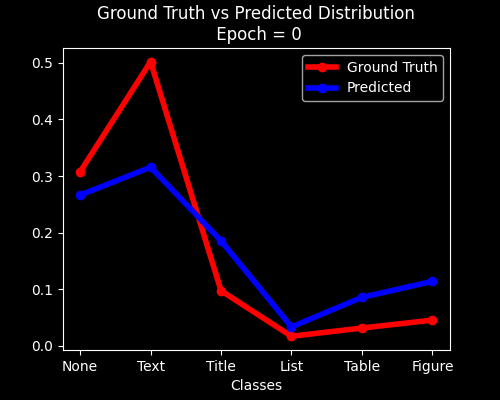

# Layout VAE

## Introduction
This repository provides PyTorch 1.9.0 implementation of Layout VAE [[1]](#1) ( Layout Variational Auto Encoder ). It is a probabilistic and autoregressive model which generates the scene layout using latent variables in lower dimensions . It is capable of generating different layouts using the same data point.

## Architecture

## Requirements
- PyTorch 1.9.0
- Python 3.8

## Datasets
* **PubLayNet** : It is a dataset for document layout analysis.  It contains images of research papers and articles and annotations for various elements in a page such as “text”, “list”, “figure” etc in these research paper images. The dataset was obtained by automatically matching the XML representations and the content of over 1 million PDF articles that are publicly available on PubMed Central.[[2]](#2)
* We sorted the cordinates of Bounding boxes in left to right direction. and used 50% data as train data and 5% test data.  

## Getting Started

Click  on the above Badge to quickstart the LayoutVAE in google colab

## Results
### CountVAE

### BBoxVAE

## References
<a id="1">[1]</a>
LayoutVAE: Stochastic Scene Layout Generation from a Label Set.Akash Abdu Jyothi and Thibaut Durand and Jiawei He and Leonid Sigal and Greg Mori [Paper](https://arxiv.org/abs/1907.10719)

<a id="2">[2]</a>
PubLayNet : By Xu Zhong, Jianbin Tang, Antonio Jimeno Yepes [Dataset](https://developer.ibm.com/exchanges/data/all/publaynet/)
